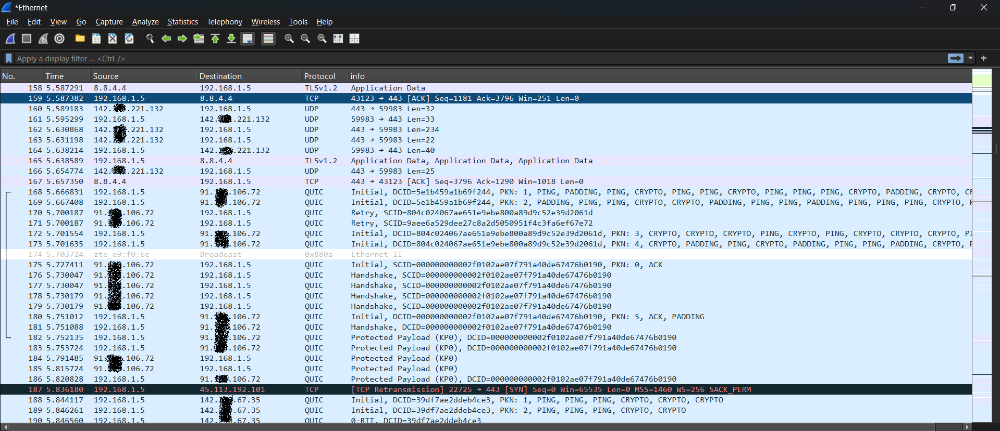
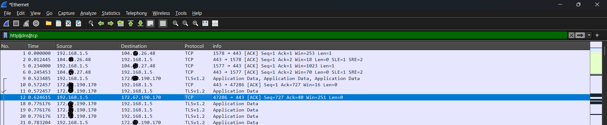
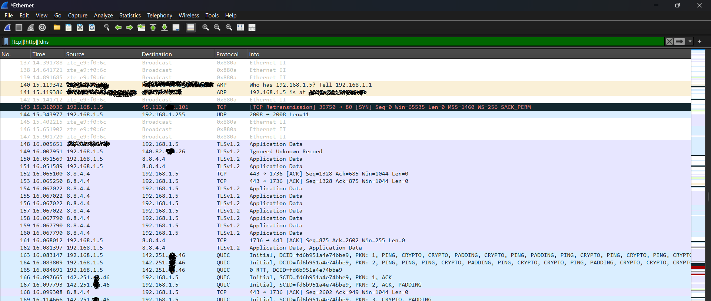

# Elevate-labs-Cybersecurity-Task-05
A repository for the task 05 from the Elevate labs, Cybersecurity

# Task 5: Network Traffic Analysis (Elevate Labs Internship)

## Overview

This repository documents the process and findings for Task 5 of the Elevate Labs Cyber Security Internship. The objective was to capture, filter and analyze live network traffic using Wireshark, focusing on protocol identification and hands-on inspection. For privacy, only annotated screenshots are shared instead of the raw PCAP file.

## Setup

- **Tool:** Wireshark (free)
- **Target:** Browsed `elevatelabs.in` in normal conditions
- **OS:** Windows 10/11
- **Interface:** Ethernet

## Screenshots

### 1. Normal Traffic (All Protocols)

Shows typical TCP, UDP, TLS, and QUIC packets during web browsing.

### 2. Protocol Filtering (tcp, http, dns)

Filtered view demonstrating focus on TCP (web sessions), HTTP/HTTPS, and DNS traffic for deeper inspection.

### 3. Other Protocols (e.g., ARP)

Illustrates discovery of additional protocols (like ARP) and network broadcasts in the local network.

## Protocols Identified

| Protocol   | Description                                    | Screenshot           |
|------------|------------------------------------------------|----------------------|
| TCP        | Reliable web/transport connections (HTTPS)      | elevatel-labs.jpg    |
| HTTP/HTTPS | Web traffic, mostly encrypted (port 443)        | filtered.jpg         |
| DNS        | Resolves web domain names to IP addresses       | filtered.jpg         |
| ARP        | Local network MAC/IP resolution                 | other-ips.jpg        |
| QUIC       | Modern web transport protocol                   | elevatel-labs.jpg    |
| UDP        | Simple connectionless packets                   | elevatel-labs.jpg    |

## Protocol Summary

- **TCP:** Used for reliable communication, e.g., HTTPS connections between your browser and servers.
- **DNS:** Lookup requests quickly sent to resolve `elevatelabs.in` before HTTPS session begins.
- **HTTP/HTTPS:** Shows encrypted traffic with TLS details, but headers and payloads are hidden.
- **ARP:** Device-level protocol for mapping IP to Ethernet (MAC) address in LAN.
- **QUIC:** Modern UDP-based web transport layer visible in some traffic flows.

## Privacy Notice

- Sensitive info such as IP and MAC addresses are obfuscated in screenshots.
- No PCAP files are uploaded to protect user and network privacy.

## How to Use This Repo

Open each screenshot and review the packet list and info for protocol identification and analysis. Refer to summary tables and notes for clarification of network concepts.

---
